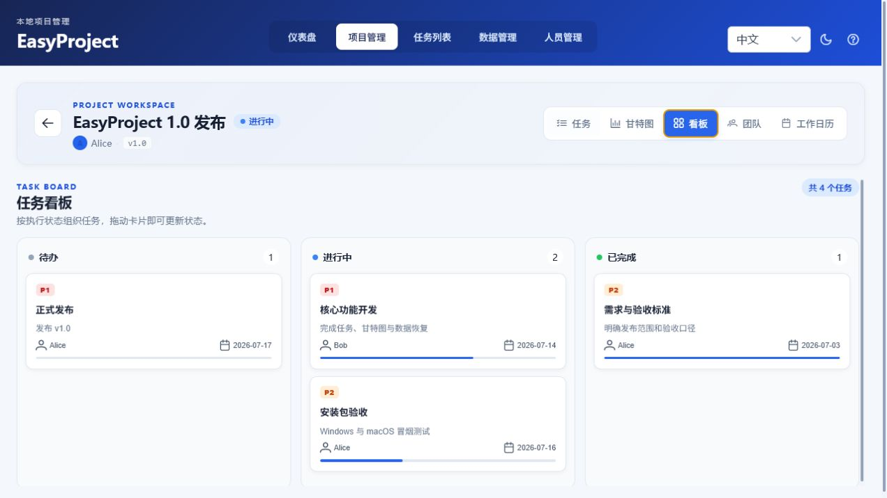
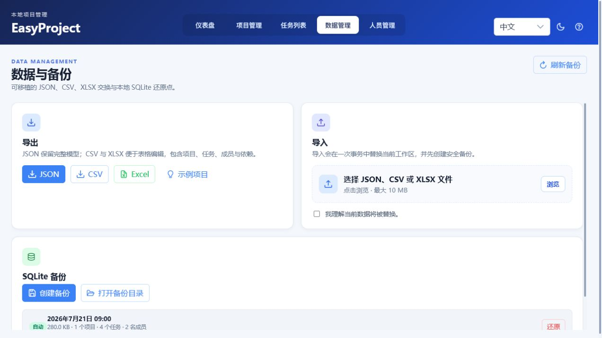
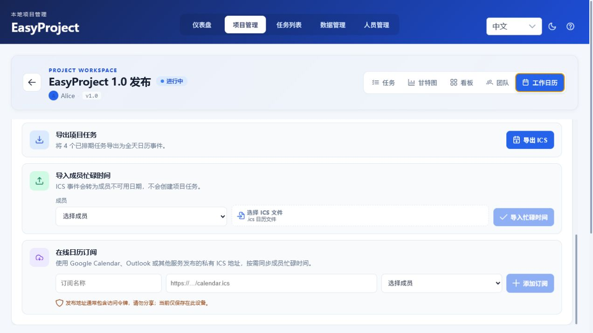

# EasyProject

EasyProject is an open-source, local-first desktop project planning application. It combines structured task planning, dependency-aware scheduling, execution views, portable data exchange, and local recovery without requiring an account.



<details>
<summary>More screenshots</summary>





</details>

## Current capabilities

- Create, edit, archive, and soft-delete projects.
- Start from blank, software-release, marketing-campaign, or writing templates; generated tasks are scheduled on the project work calendar with dependencies intact.
- Create and maintain tasks with dates, status, priority, assignee, parent, and project association; assignees must be active members of the project team.
- Track task progress and finish-to-start dependencies with cycle prevention.
- Plan in a linked daily Gantt view with task bars, milestones, progress, and dependency lines.
- Switch each project between task list, Gantt, board, team, and work-calendar views.
- Drag board cards between To do, In progress, and Done; completed cards automatically reach 100%.
- Export and import schema-v5 JSON, CSV, or formatted XLSX workbooks with mapping previews, including plan baselines and model relationships.
- Export project tasks as ICS and import external busy events into member availability.
- Subscribe to private published Google Calendar, Outlook, or other ICS URLs for on-demand busy-time sync.
- Undo and redo the last 30 data-changing actions with `Ctrl+Z` and `Ctrl+Y`.
- Create and inspect local SQLite backups. Startup and periodic automatic snapshots retain the latest 10 copies; imports and restores create safety backups.
- Store data locally in SQLite under the operating system application-data directory.
- Preserve the legacy development database on first upgrade by copying it into the application-data directory.
- Validate editable fields in the Rust service layer.
- Restrict remote calendar targets, backup restore paths, WebView content sources, and production log verbosity.

## Technology

- Vue 3, Vite, and PrimeVue
- Tauri 2 and Rust
- SQLite through `rusqlite`

## Development

Requirements: Node.js, npm, Rust, and the platform prerequisites for Tauri 2.

```bash
npm install
npm run tauri:dev
```

Useful checks:

```bash
npm run lint
npm test
npm run test:e2e
npm run build
npm run release:check
cd src-tauri
cargo check
cargo test
```

## Project documentation

- Product and implementation plan: [`docs/PROJECT_PLAN.md`](docs/PROJECT_PLAN.md)
- v0.1 release audit and remaining risks: [`docs/AUDIT_2026-08-08.md`](docs/AUDIT_2026-08-08.md)
- Release and platform smoke tests: [`docs/RELEASING.md`](docs/RELEASING.md)
- Draft v0.1.0 release notes: [`docs/RELEASE_NOTES_0.1.0.md`](docs/RELEASE_NOTES_0.1.0.md)
- Example import snapshot: [`public/examples/easy-project-example.json`](public/examples/easy-project-example.json)
- The Wolai Project page remains the collaborative source for product scope, linked feature databases, models, and milestones.

## Delivery roadmap

1. M0–M3 — local MVP, project/task workspace, Gantt planning, and data recovery. Complete.
2. M4–M8 — unified experience, members, resource load, baselines, and dependency enhancements. Complete.
3. M9 — performance, automated tests, quality gates, packaging, and first public release. In progress.

## Desktop releases

The release workflow creates unsigned Windows x64 MSI/NSIS installers and macOS Apple Silicon/Intel APP and DMG bundles. See [`docs/RELEASING.md`](docs/RELEASING.md) for versioning, artifact validation, and signing requirements.

## Data safety

Project data is stored locally in the operating system application-data directory. Use the Data view to inspect recovery-point contents, create manual backups, open the backup directory, exchange complete snapshots, or restore an earlier SQLite backup. Restore validates the source first and creates a rollback point before replacing current data.

The native exchange format is currently schema v5. Imports from v1 through v5 are accepted; invalid relationships or failed replacements roll back without changing the current workspace.

Published calendar URLs commonly contain secret access tokens. EasyProject stores subscription settings only on the current device; treat those URLs as passwords and revoke them at the provider if exposed. OAuth account access and two-way event editing are intentionally outside the current release.

## Contributing and license

Contributions are welcome. See [`CONTRIBUTING.md`](CONTRIBUTING.md) for quality gates and development expectations. EasyProject is licensed under the [MIT License](LICENSE).
